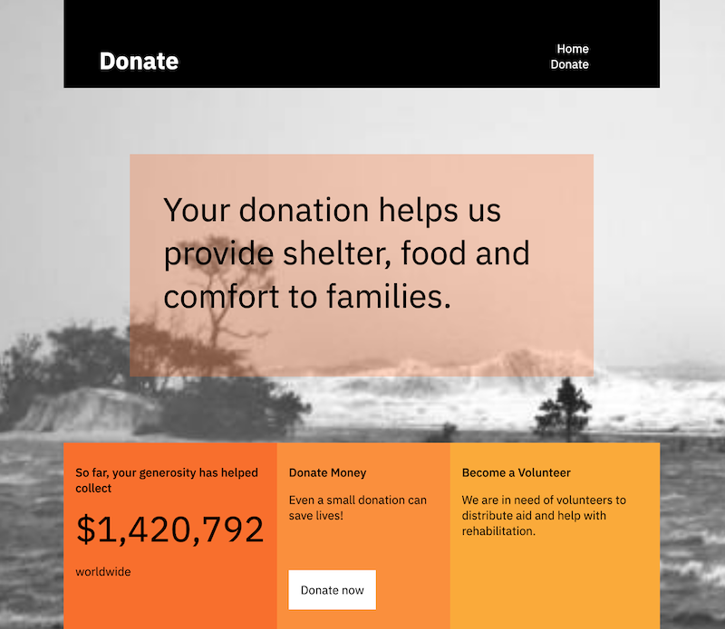

# Disaster Donations Website

In this code pattern, we will create a disaster donations website
using a node.js Express app, and a python backend app (exposing a
RESTful API). The website presents an interface to learn about the
latest news after a natural disater, and allows the reader to donate
to the cause. Since this credit card data being accepted is sensitive,
we recommend running it in an environment where it's protect, through
storage encryption, and other mechanisms.

The website consists of a [frontend](./frontend) and
[backend](./backend). The frontend is a node.js Express app, serving
the site itself. The donations page has AJAX calls into the backend
application. This backend application is a python app, taking in
RESTful JSON requests, and translating to MongoDB calls.

When you have completed this code pattern, you will understand how to:

* Create and run a simple node.js application
* Install the prerequisites and run a python backend application
* Use Docker to build and run containerised applications
* (Optional) Deploy an nginx reverse proxy

## Steps

The frontend and backend applications can both be run locally, or in
the IBM Cloud in a Linux VM, for example an [IBM Cloud Hyper Protect
Virtual
Server](https://cloud.ibm.com/catalog/services/hyper-protect-virtual-server).

Follow the steps in the readme files for the

- [frontend](./frontend)
- [backend](./backend)
- (Optional) [proxy](./proxy)

## Sample output

A website will be functional and served by the machine you're running
this code pattern on:

## License

This code pattern is licensed under the Apache License,
Version 2. Separate third-party code objects invoked within this code
pattern are licensed by their respective providers pursuant to their
own separate licenses. Contributions are subject to the [Developer
Certificate of Origin, Version 1.1](https://developercertificate.org/)
and the [Apache License, Version
2](https://www.apache.org/licenses/LICENSE-2.0.txt).

[Apache License
FAQ](https://www.apache.org/foundation/license-faq.html#WhatDoesItMEAN)
